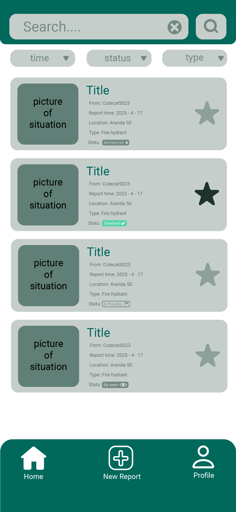
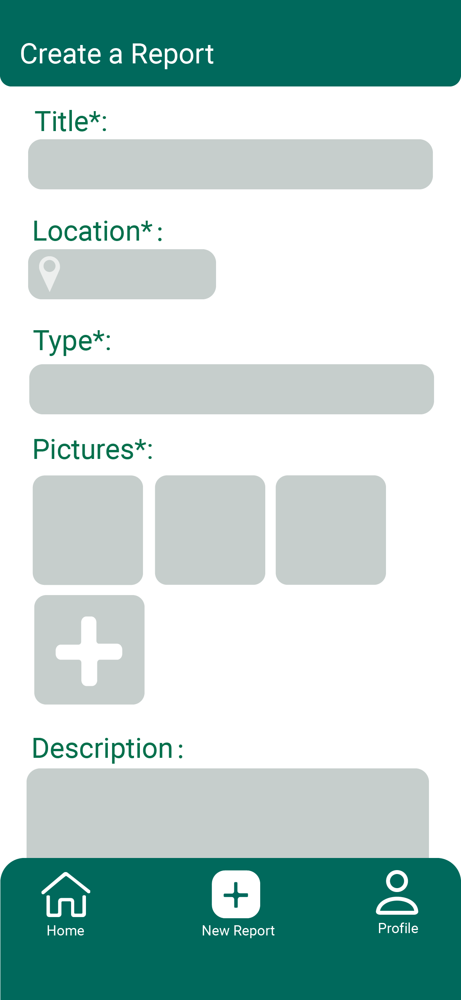
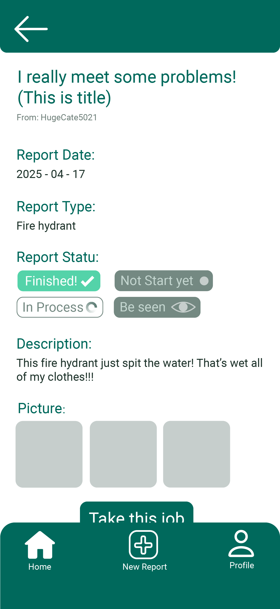
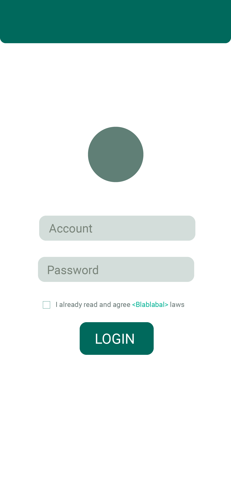
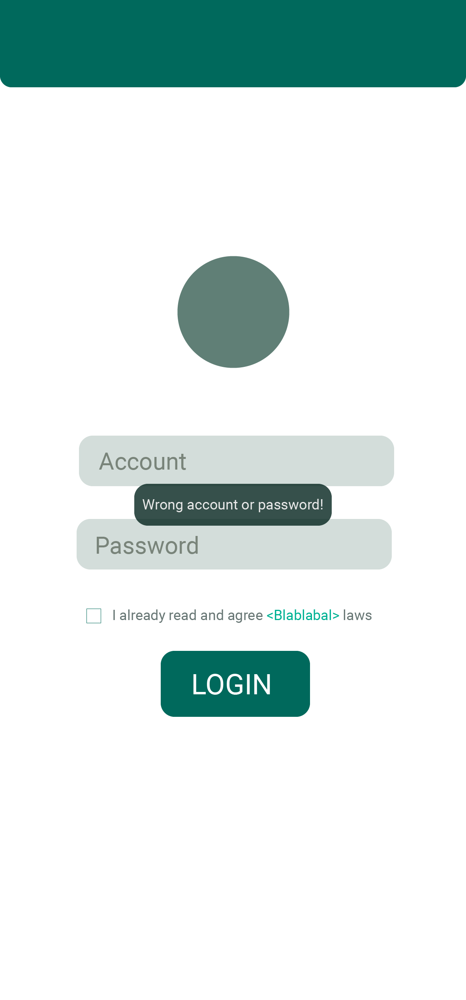
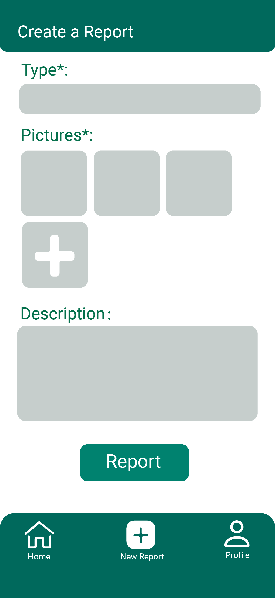
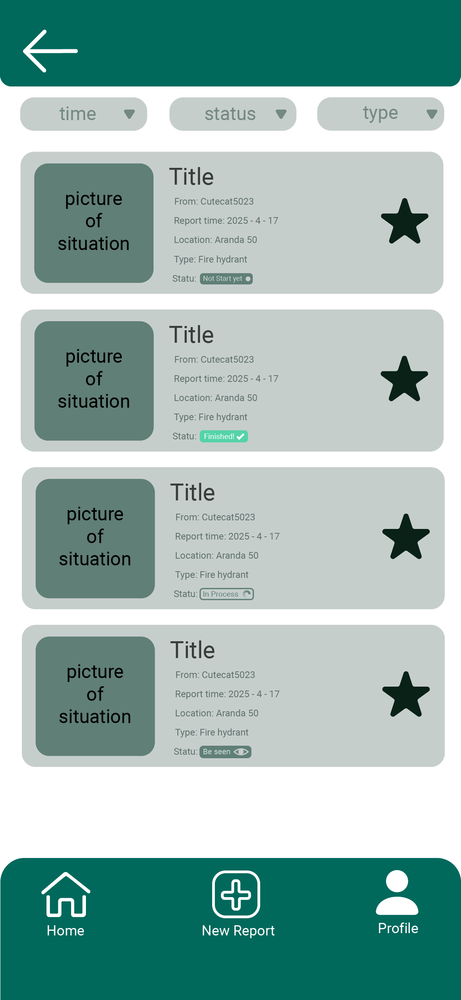
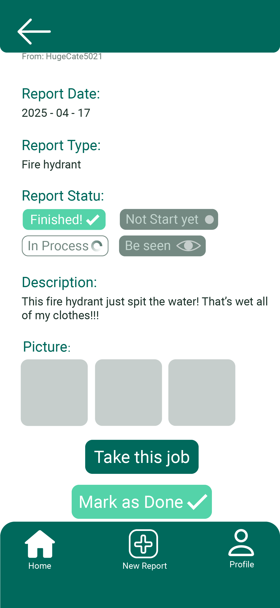
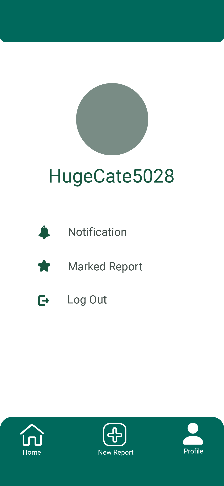

# CityFix

  <b>UI preview</b> — snapshots taken from the submitted group build
    
  
  &nbsp;
  
  &nbsp;
  

---

Android app (Java) for **citizen and worker** urban maintenance reports: create
issues with **photos and a map pin**, **Firestore**-backed report lists (with
pagination, filters, and a boolean search), **favourites**, in-app
**notifications**, and an **LLM Q\&A** screen.

Group **G04**, **COMP6442** Semester 1, 2025, Australian National University.

> **This repository is a portfolio mirror of our coursework project.** The
> upstream lived on the ANU GitLab instance. Team member lines are given in
> Javadoc in the source; this README does not specify individual marks or roles
> for grading.

## More screenshots

### Login

  
  

### Report lists and favourites

  
  
  

### Submit a report and track its status

  
  
  

### Profile

  

## Build

- **JDK 17** + **Android Studio** (recommended).
- `minSdk` is **33** (Android 13) — use a compatible device or emulator.
- **Secrets:** copy `secrets.properties.example` to `secrets.properties` in
  the project **root** (the folder that contains `settings.gradle`), and set:
  - `HUGGINGFACE_TOKEN` / `GEMINI_API_KEY` — for optional LLM features
  - `MAPS_API_KEY` — for Google Maps (same key type as the Cloud Console
    *Maps SDK for Android*)
- `google-services.json` must match your Firebase project (as for any Android
  + Firestore / Realtime DB app). For a new checkout you usually download it
  from the Firebase console.

## Run

Open the project in Android Studio, select the `app` run configuration, deploy
to a device with Google Play services.

## License

The About screen in the app references the Apache 2.0 text as written in the
course. For this GitHub mirror, treat the app source as team-authored unless a
per-file header says otherwise; if you need a single SPDX license for the
repo, open an issue and we can align the team on Apache-2.0 or MIT for the
portfolio copy.

**Rotate any API keys** that have ever been committed in plain text before
this migration.
